# Between Sessions — DATA_MODELS.md

> Draft physical data model for the hackathon MVP.
>
> **Important:** the EER below is the **conceptual/logical model**. DynamoDB is the physical model. Do not implement the EER as one DynamoDB table per entity. The physical schema is driven by access patterns and uses a single DynamoDB table with composite keys and sparse GSIs.

## 1. Design Decision

Between Sessions uses two representations:

### Conceptual model — EER

Useful for:

- understanding domain entities;
- communicating the system to teammates/judges;
- documenting ownership and relationships;
- validating privacy/consent boundaries.

### Physical model — DynamoDB single table

Useful for:

- predictable MVP query patterns;
- fewer infrastructure objects;
- low operational overhead;
- data locality;
- efficient Lambda access;
- fast hackathon implementation.

AWS recommends starting DynamoDB modeling from access patterns rather than normalized relational thinking, and notes that single-table design works particularly well when entities have correlated access patterns. citeturn761378search2turn761378search4

---

# 2. Core Entities

The concept document identifies these minimum viable entities:

- User
- Consent
- JournalEntry
- PracticeLog
- Practitioner
- Connection
- AIInsight
- AuditLog

That source model is extended here with **CheckIn, OnboardingProfile, Verification, ConnectionRequest, Recommendation, EducationModule, and SafetyResource** because those are explicit MVP workflows rather than arbitrary database additions. The concept also defines user onboarding/education, behavioral journal, ERP companion, professional connection, verification, recommendations, and safety-resource requirements. fileciteturn4file0L213-L245 fileciteturn4file0L250-L285 fileciteturn4file0L289-L321

---

# 3. Conceptual EER

```mermaid
erDiagram

    USER ||--|| ONBOARDING_PROFILE : has
    USER ||--o{ CHECK_IN : records
    USER ||--o{ JOURNAL_ENTRY : writes
    USER ||--o{ PRACTICE_LOG : completes
    USER ||--o{ AI_INSIGHT : receives
    USER ||--o{ CONSENT : grants
    USER ||--o{ CONNECTION : owns
    USER ||--o{ CONNECTION_REQUEST : creates
    USER ||--o{ RECOMMENDATION : receives
    USER ||--o{ AUDIT_LOG : generates

    PRACTITIONER ||--|| VERIFICATION : has
    PRACTITIONER ||--o{ CONNECTION : participates_in
    PRACTITIONER ||--o{ CONNECTION_REQUEST : receives
    PRACTITIONER ||--o{ RECOMMENDATION : authors
    PRACTITIONER ||--o{ AUDIT_LOG : generates

    CONNECTION ||--o{ CONSENT : governed_by

    USER {
        string userId PK
        string cognitoSub
        string displayName
        string ageBand
        string language
        string goal
        string status
        datetime createdAt
        datetime updatedAt
    }

    ONBOARDING_PROFILE {
        string userId PK,FK
        string goal
        string language
        map preferences
        datetime safetyAcknowledgedAt
        datetime privacyAcknowledgedAt
        datetime createdAt
        datetime updatedAt
    }

    CHECK_IN {
        string checkInId PK
        string userId FK
        date localDate
        number distress
        string reflection
        datetime createdAt
    }

    JOURNAL_ENTRY {
        string entryId PK
        string userId FK
        string trigger
        number urge
        string responseType
        string outcome
        string reflection
        string[] tags
        datetime createdAt
    }

    PRACTICE_LOG {
        string practiceId PK
        string userId FK
        string exerciseId
        boolean completed
        number preDistress
        number postDistress
        number durationSeconds
        datetime completedAt
    }

    AI_INSIGHT {
        string insightId PK
        string userId FK
        string type
        string summary
        string[] sourceMetricIds
        string model
        string promptVersion
        date periodStart
        date periodEnd
        datetime generatedAt
    }

    CONSENT {
        string consentId PK
        string userId FK
        string connectionId FK
        string purpose
        string[] dataCategories
        string status
        datetime grantedAt
        datetime revokedAt
    }

    PRACTITIONER {
        string practitionerId PK
        string cognitoSub
        string name
        string role
        string specialties
        string languages
        string city
        string status
        datetime createdAt
    }

    VERIFICATION {
        string practitionerId PK,FK
        string registrationReference
        string verificationStatus
        string[] documents
        datetime verifiedAt
        datetime reviewedAt
    }

    CONNECTION {
        string connectionId PK
        string userId FK
        string practitionerId FK
        string status
        datetime startedAt
        datetime endedAt
    }

    CONNECTION_REQUEST {
        string requestId PK
        string userId FK
        string practitionerId FK
        string status
        string message
        datetime createdAt
        datetime updatedAt
    }

    RECOMMENDATION {
        string recommendationId PK
        string userId FK
        string practitionerId FK
        string type
        string note
        string nextStep
        string referral
        datetime createdAt
    }

    AUDIT_LOG {
        string auditId PK
        string actorId
        string actorRole
        string action
        string resourceType
        string resourceId
        string metadata
        datetime timestamp
    }
```



---

# 4. Relationship Semantics

| Relationship | Meaning |
|---|---|
| User → OnboardingProfile | One current onboarding profile per user |
| User → CheckIn | One user has many time-series check-ins |
| User → JournalEntry | One user has many behavioral records |
| User → PracticeLog | One user has many practice attempts |
| User → AIInsight | One user has many generated insights |
| User → Consent | One user can have many purpose/recipient-specific consents |
| User ↔ Practitioner | Many-to-many logically; represented by Connection |
| Connection → Consent | Consent governs access within a user/practitioner relationship |
| Practitioner → Verification | One current verification state |
| Practitioner → Recommendation | Human-authored care/navigation recommendations |
| User/Practitioner → AuditLog | Sensitive actions produce audit events |

### Critical rule

A **Connection does not imply consent to every data category**.

Example:

```text
Connection = ACTIVE
Consent:
  checkins = allowed
  practice_logs = allowed
  journal_free_text = denied
  ai_summary = allowed
```

This distinction is fundamental to the product's privacy model. The concept explicitly requires granular, revocable professional-sharing permissions. fileciteturn4file0L271-L285

---

# 5. DynamoDB Physical Model

## Table

```text
Table: BetweenSessions
PK: string
SK: string
Billing: PAY_PER_REQUEST
```

For a hackathon MVP, on-demand capacity keeps capacity planning out of the critical path; revisit capacity mode after real traffic data exists.

AWS recommends minimizing table count where practical and designing around access patterns, while also noting that multiple tables can make sense when operational characteristics differ substantially. citeturn761378search0turn761378search4

---

## 6. Item Collection Layout

### User-owned collection

```text
PK = USER#<userId>

SK = PROFILE
SK = ONBOARDING
SK = CHECKIN#<timestamp>
SK = JOURNAL#<timestamp>#<entryId>
SK = PRACTICE#<timestamp>#<practiceId>
SK = AI#WEEK#<weekStart>
SK = CONSENT#<purpose>#<recipientId>
SK = CONNECTION#<practitionerId>
SK = REQUEST#<timestamp>#<practitionerId>
SK = RECOMMENDATION#<timestamp>#<recommendationId>
```

This lets one query return the user's time-oriented records or specific prefixes by sort-key range.

Composite sort keys are a standard DynamoDB way to model one-to-many relationships and grouped item collections. citeturn761378search8

---

## 7. Practitioner-Owned Collection

```text
PK = PRACTITIONER#<practitionerId>

SK = PROFILE
SK = VERIFICATION
SK = REQUEST#<timestamp>#<userId>
SK = CONNECTION#<userId>
SK = RECOMMENDATION#<timestamp>#<userId>#<recommendationId>
```

This makes the main practitioner dashboard queryable without scanning the full table.

---

# 8. Sparse GSI Plan

Keep GSIs intentionally small.

## GSI1 — Practitioner Requests

```text
GSI1PK = PRACTITIONER#<practitionerId>
GSI1SK = REQUEST#<createdAt>#<userId>
```

Use:

```text
Query incoming requests for practitioner
```

## GSI2 — User Connections

```text
GSI2PK = USER#<userId>
GSI2SK = CONNECTION#<status>#<practitionerId>
```

Use:

```text
List user's active/pending connections
```

## GSI3 — Consent Recipient Lookup

Only populate when a consent record has a recipient.

```text
GSI3PK = RECIPIENT#<practitionerId>
GSI3SK = CONSENT#<grantedAt>#<userId>
```

Useful for practitioner authorization/debugging and consent administration.

## GSI4 — Recommendation Lookup

```text
GSI4PK = PRACTITIONER#<practitionerId>
GSI4SK = RECOMMENDATION#<createdAt>#<userId>
```

Use:

```text
List recommendations authored by practitioner
```

### Why sparse?

A GSI should only contain items that participate in that query pattern. AWS specifically recommends sparse GSIs and index overloading to keep indexes efficient. citeturn761378search11

---

# 9. Access-Pattern Matrix

DynamoDB should be designed from the questions the application asks.

| ID | Access pattern | Operation | Key |
|---|---|---|---|
| AP1 | Load user profile | GetItem | `USER#id / PROFILE` |
| AP2 | Load onboarding | GetItem | `USER#id / ONBOARDING` |
| AP3 | Add check-in | PutItem | `USER#id / CHECKIN#timestamp` |
| AP4 | Get recent check-ins | Query | `PK=USER#id`, `begins_with(SK,CHECKIN#)` |
| AP5 | Add behavior log | PutItem | `USER#id / JOURNAL#timestamp#id` |
| AP6 | Get behavior range | Query | `PK=USER#id`, `begins_with(SK,JOURNAL#)` + time range |
| AP7 | Add practice | PutItem | `USER#id / PRACTICE#timestamp#id` |
| AP8 | Build weekly dashboard | Query | User item collection + projection |
| AP9 | Get weekly AI summary | GetItem | `USER#id / AI#WEEK#date` |
| AP10 | Grant/revoke consent | UpdateItem | `USER#id / CONSENT#...` |
| AP11 | Practitioner request inbox | Query GSI1 | `PRACTITIONER#id` |
| AP12 | User connection list | Query GSI2 | `USER#id` |
| AP13 | Get practitioner profile | GetItem | `PRACTITIONER#id / PROFILE` |
| AP14 | Get verification | GetItem | `PRACTITIONER#id / VERIFICATION` |
| AP15 | Practitioner patient summary | Query user collection after authorization | `USER#id` |
| AP16 | Create recommendation | PutItem | `USER#id / RECOMMENDATION#timestamp#id` |
| AP17 | Audit sensitive access | PutItem | `AUDIT#date / timestamp#uuid` |

Do not introduce a scan-based dashboard query into the MVP.

AWS recommends documenting access patterns before finalizing a DynamoDB model and using the data shape that directly answers those queries. citeturn761378search9turn761378search10

---

# 10. Denormalization Strategy

Some duplication is intentional.

Example:

```json
{
  "PK": "PRACTITIONER#p123",
  "SK": "REQUEST#2026-09-17T08:20:00Z#u456",
  "entityType": "ConnectionRequest",
  "userId": "u456",
  "userDisplayName": "Alex",
  "status": "PENDING"
}
```

`userDisplayName` may be duplicated into the practitioner request item so the request inbox can render without an additional read.

Likewise, a connection record can include small display-only practitioner fields.

### Rule

Duplicate **read-optimized, non-authoritative fields** only.

Never duplicate:

- consent state as the authorization source;
- verification state as a security source;
- clinical facts;
- sensitive journal text.

The authoritative record remains the canonical item.

---

# 11. Consistency Rules

## Strong consistency

Use strongly consistent reads only where the user would otherwise see a dangerous or confusing authorization state:

- immediately after consent revocation;
- practitioner access decision;
- verification status transition where a permission depends on it.

Do not make the entire application strongly consistent by default.

## Optimistic concurrency

Add:

```text
version: number
```

to mutable items such as:

- Consent
- Connection
- Verification

Write with a condition such as:

```text
version = expectedVersion
```

incrementing the version after a successful update.

AWS recommends optimistic locking for infrequent conflicts on single-item updates and transactions where multiple items must change atomically. citeturn761378search14

---

# 12. Atomic Operations

### Accept connection

Use a transaction only if the MVP implementation creates multiple records that must remain consistent:

```text
ConnectionRequest → ACCEPTED
Connection → ACTIVE
```

Otherwise keep the request lifecycle simpler and favor a single authoritative state transition.

### Revoke professional access

At minimum:

```text
Consent → REVOKED
```

The authorization layer must check the current consent item before serving patient data.

Do not rely on cached UI state.

---

# 13. Time and Sort-Key Conventions

All timestamps:

```text
UTC ISO-8601
```

Example:

```text
2026-09-17T08:35:41Z
```

For ordering, use fixed-width sortable timestamps.

Recommended:

```text
CHECKIN#2026-09-17T08:35:41.000Z
```

For UUIDs:

```text
JOURNAL#2026-09-17T08:35:41.000Z#01J...
```

This gives chronological ordering while preventing timestamp collisions from becoming the unique identifier.

---

# 14. Item Shape

Every item should include:

```json
{
  "PK": "...",
  "SK": "...",
  "entityType": "JournalEntry",
  "version": 1,
  "createdAt": "2026-09-17T08:35:41.000Z",
  "updatedAt": "2026-09-17T08:35:41.000Z"
}
```

Optional:

```text
GSI1PK
GSI1SK
GSI2PK
GSI2SK
...
```

Avoid generic `data` blobs. Explicit attributes make validation, authorization and AI extraction easier.

---

# 15. Privacy Model at Data Layer

The database does not decide whether a practitioner may see a record.

Authorization flow:

```text
Cognito identity
      ↓
actor role
      ↓
Cedar policy / authorization service
      ↓
connection status
      ↓
consent purpose
      ↓
requested data category
      ↓
DynamoDB read
```

Example:

```text
Practitioner P requests:
USER#U / JOURNAL#...

Check:
  P verified?
  connection P-U active?
  consent active?
  journal category allowed?

Only then:
  read
```

This implements the concept's least-privilege requirement that users see their own data and practitioners see only consented data. fileciteturn4file0L413-L437

---

# 16. AI Data Boundary

AI should receive a prepared DTO, not arbitrary DynamoDB items.

Example:

```json
{
  "week": "2026-09-14/2026-09-20",
  "checkins": [
    {"date":"2026-09-15","distress":6},
    {"date":"2026-09-16","distress":7}
  ],
  "practice": {
    "completed": 3,
    "averagePre": 7.0,
    "averagePost": 4.3
  },
  "behavior": {
    "avoidanceEvents": 4,
    "compulsionEvents": 2
  }
}
```

This reduces accidental prompt leakage and makes the AI output auditable.

The concept requires AI insights to be traceable to user-provided metrics and explicitly excludes diagnosis, medication advice, autonomous crisis assessment, reassurance, and autonomous exposure prescription. fileciteturn4file0L322-L353

---

# 17. Free Text Policy

Free text is the highest-risk application field.

For MVP:

- keep it optional;
- enforce reasonable maximum length;
- never log it to CloudWatch;
- never include it in AI input unless explicitly selected;
- never expose it to practitioners unless separately consented;
- avoid using it as an authorization signal.

Prefer structured fields:

```text
urge
responseType
tags
outcome
preDistress
postDistress
duration
```

---

# 18. Audit Model

Audit events should capture:

```json
{
  "PK": "AUDIT#2026-09-17",
  "SK": "2026-09-17T08:35:41.000Z#uuid",
  "entityType": "AuditLog",
  "actorId": "p123",
  "actorRole": "practitioner",
  "action": "READ_PATIENT_SUMMARY",
  "resourceType": "User",
  "resourceId": "u456",
  "reason": "active_connection",
  "requestId": "uuid"
}
```

Do not store private journal content inside an audit record.

---

# 19. Retention / TTL

TTL is suitable for data with a deliberately defined expiry.

Potential future uses:

```text
temporary demo tokens
ephemeral job records
temporary AI processing artifacts
old operational events
```

Do **not** put TTL on user health/behavior records merely because TTL is available. Retention is a product/privacy policy decision.

AWS documents TTL as a mechanism for aging data out of DynamoDB based on an epoch timestamp. citeturn761378search12

---

# 20. S3 Boundary

DynamoDB should not contain large blobs.

Future examples:

```text
practitioner credential documents
large exports
generated reports
audio assets
attachments
```

Store large objects in S3 and keep metadata/reference keys in DynamoDB.

AWS recommends storing only metadata in DynamoDB for large objects and using S3 for large blobs. citeturn761378search11

---

# 21. Hackathon Rules of Thumb

### Rule 1 — Optimize for the demo's reads

The MVP only needs a handful of reliable access patterns.

### Rule 2 — Do not over-engineer GSIs

Start with the minimum indexes that answer real queries.

### Rule 3 — Prefer one query over many reads

User dashboard data should be colocated in the user's item collection.

### Rule 4 — Security state is authoritative

Consent and verification are never cached in a frontend-only flag.

### Rule 5 — Do not model future products

No marketplace tables, appointment scheduling tables, messaging tables, wearable telemetry tables, insurance tables, or EHR interoperability objects.

### Rule 6 — Synthetic demo data only

The hackathon seed dataset must contain fictional records.

### Rule 7 — Keep the schema reversible

Entity prefixes and explicit `entityType` values make future migration easier.

---

# 22. Future Extensions

Not MVP:

```text
OpenSearch
EventBridge-driven reminders
Step Functions verification workflow
multi-tenant institutional accounts
appointment/referral workflow
native mobile clients
population-level aggregates
de-identified research dataset
broader anxiety / mental-health modules
```

These remain extensions of the existing access patterns rather than reasons to redesign the MVP.

---

# 23. Final Physical Model

```text
                 ┌───────────────────────────────┐
                 │      BetweenSessions           │
                 │       DynamoDB Table           │
                 ├───────────────────────────────┤
 USER COLLECTION │ USER#<userId>                  │
                 │ ├─ PROFILE                     │
                 │ ├─ ONBOARDING                  │
                 │ ├─ CHECKIN#<timestamp>         │
                 │ ├─ JOURNAL#<timestamp>#<id>    │
                 │ ├─ PRACTICE#<timestamp>#<id>   │
                 │ ├─ AI#WEEK#<week>              │
                 │ ├─ CONSENT#<purpose>#<recipient│
                 │ ├─ CONNECTION#<practitioner>   │
                 │ └─ RECOMMENDATION#<timestamp>  │
                 │                               │
 PRACTITIONER    │ PRACTITIONER#<id>              │
 COLLECTION      │ ├─ PROFILE                     │
                 │ ├─ VERIFICATION                │
                 │ ├─ REQUEST#<timestamp>#<user>  │
                 │ └─ RECOMMENDATION#<timestamp>  │
                 │                               │
 CONTENT         │ CONTENT#EDUCATION / #SAFETY    │
                 │                               │
 AUDIT           │ AUDIT#<date>                   │
                 └───────────────────────────────┘

               + sparse GSIs for alternate access
               + Cognito identity
               + Cedar authorization
               + API Gateway/Lambda
```

## 24. Decision Log

| Decision | Why |
|---|---|
| DynamoDB single table | Small hackathon team + correlated access patterns + low operational overhead |
| EER kept separate from physical schema | EER communicates business relationships; DynamoDB optimizes reads |
| User-centric item collection | Dashboard and longitudinal timeline are the core user access pattern |
| Sparse GSIs | Alternate practitioner/connection queries without indexing every item |
| Explicit entityType | Easier debugging, repository routing, and future migration |
| Separate Consent entity | Connection ≠ authorization |
| Separate Verification entity | Identity ≠ verified professional status |
| Source metric IDs on AIInsight | Auditable AI output |
| Minimal free text | Reduces privacy and logging risk |
| Synthetic seed data | No real mental-health data in the hackathon environment |

---

## Sources

AWS DynamoDB — Best practices for table design:  
https://docs.aws.amazon.com/amazondynamodb/latest/developerguide/bp-table-design.html

AWS DynamoDB — Data modeling foundations:  
https://docs.aws.amazon.com/amazondynamodb/latest/developerguide/data-modeling-foundations.html

AWS DynamoDB — First steps for modeling relational data:  
https://docs.aws.amazon.com/amazondynamodb/latest/developerguide/bp-modeling-nosql.html

AWS Prescriptive Guidance — Data modeling best practices:  
https://docs.aws.amazon.com/prescriptive-guidance/latest/dynamodb-data-modeling/best-practices.html
